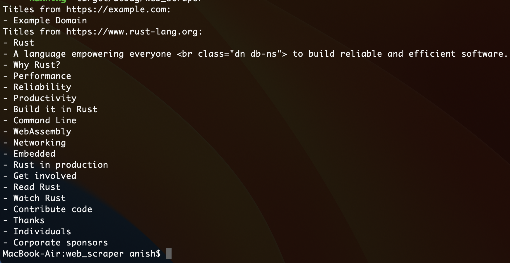

### How to Run:

- Run `cargo run` to scrape titles from the listed URLs.
- Modify the urls vector to include other websites.

### Key Features:

- Uses tokio for concurrent HTTP requests.
- Parses HTML with scraper to extract `<h1>`, `<h2>`, and `<h3>` titles.
- Handles errors gracefully for failed requests.

**Note**: Some websites may block scrapers or require headers. You may need to add user-agent headers to reqwest for production use.

P.S. Coding methodology inspired by the KISS (Keep It Simple, Stupid) principle.

> “Just Gork It Silly!”
